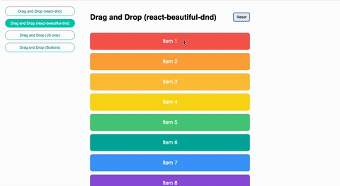

# Drag and Drop Demo

This project demonstrates different implementations of drag and drop functionality in React applications. It showcases various approaches to implementing drag and drop features, from pure JavaScript to popular React libraries.



## Features

- Multiple drag and drop implementations:
  - React DnD (react-dnd)
  - React Beautiful DnD (react-beautiful-dnd)
  - Pure JavaScript implementation
  - Button-based drag and drop

## Technologies Used

- React 18
- TypeScript
- Vite
- React Router DOM
- Styled Components
- React DnD
- React Beautiful DnD

## Getting Started

1. Clone the repository
2. Install dependencies:

   ```bash
   npm install
   ```

3. Start the development server:

   ```bash
   npm run dev
   ```

4. Open [http://localhost:5173](http://localhost:5173) in your browser

## Available Scripts

- `npm run dev` - Start development server
- `npm run build` - Build for production
- `npm run preview` - Preview production build
- `npm run lint` - Run ESLint

## Project Structure

- `/src/components` - Reusable React components
- `/src/pages` - Page components for different drag and drop implementations
- `/src/constants` - Application constants and configuration
- `/src/types.tsx` - TypeScript type definitions

